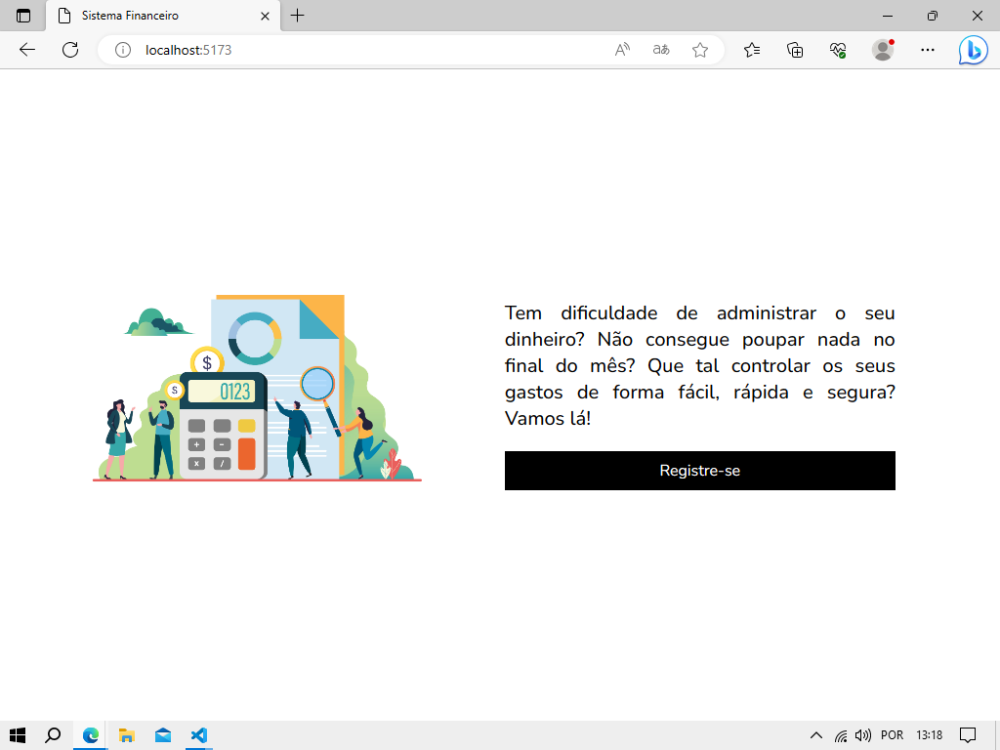

# Finacial System

# O app surgiu da necessidade de facilitar o gerenciamento financeiro. Nele você pode verificar o valor de entrada e saída da sua conta, o que comprou, quanto gastou e o saldo total disponível. Além disso, o usuário pode realizar sign up, sign in, criar, listar, deletar as suas transações e fazer logout.

# Link do reposiório do Back-End: https://github.com/financiial-system/server 

# Tecnologias utilizadas no Front-End: React, TypeScript, Styled Components, Axios, Yup.

# As tecnologias utilizadas no Back-End: Node, Express, Postgres, TypeORM, TypeScript.

# Instalando Dependências: clone o projeto em sua máquina e instale as dependências com o comando yarn

# Rodando o projeto: yarn dev

# Imagens do financial system
 

